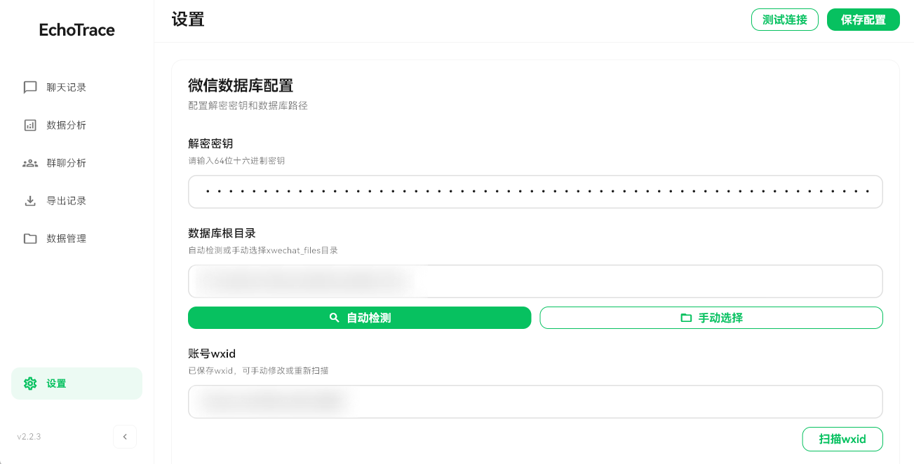
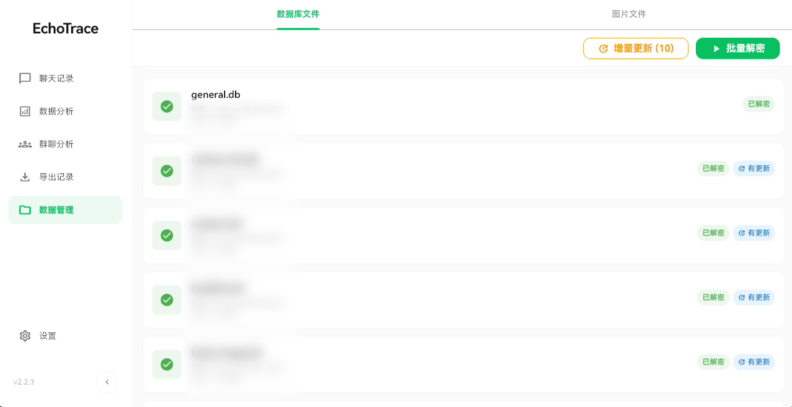
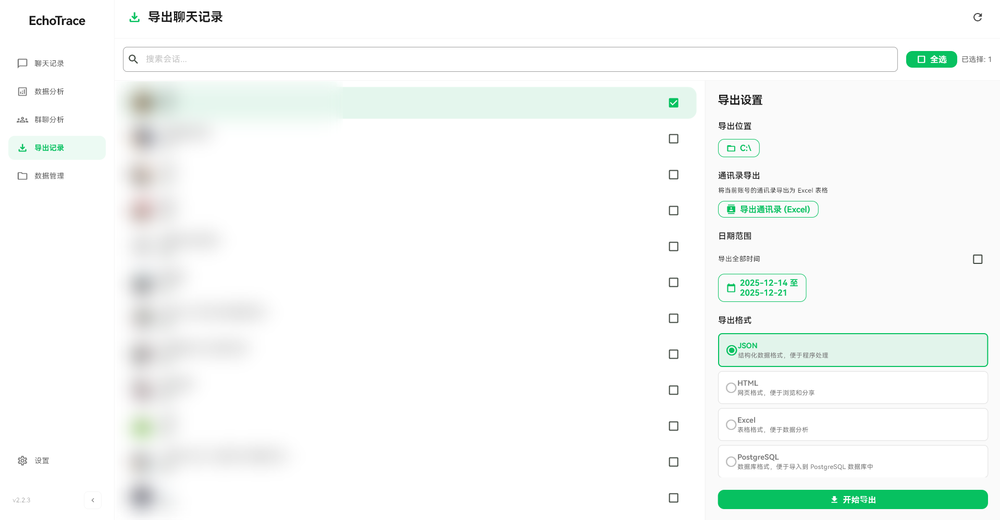

# EchoTrace 新手完全指南：从配置到数据分析与导出

欢迎使用 EchoTrace！这是一份面向初次使用者的全流程指南，我们将一步步引导你完成环境准备、密钥配置、数据库解密，最终生成年度报告或导出备份。

> **适用平台**：Windows 10+
>
> 你也可以点此查看由其他小伙伴制作的视频教程： [视频1](https://v.douyin.com/8o1DkiSc9Zo/) 或 [视频2](https://v.douyin.com/PBqrv7jiVLI/) 
> 
> 从各大社交平台刷到这个项目亦或是从好友口中推荐而来的朋友们，注册一个账号为我的项目点个star好不好！🥳

---

## 1. 准备工作（必读）

在打开软件之前，你需要准备好运行环境。

###  下载 EchoTrace
*   **下载地址**：[EchoTrace Releases](https://github.com/ycccccccy/echotrace/releases)
*   **安装**：下载最新版本的 `.zip` 压缩包，解压后双击运行 `EchoTrace.exe` 即可，无需安装，注意不要将应用放在任何包含中文的目录下 ！！！

---

## 2. 第一步：基础配置

打开 EchoTrace，点击左侧边栏进入设置页面后请按顺序完成以下配置：

### 2.1 填写密钥
*   **解密密钥**：你需要填写数据库密钥，在对应栏目填写你的数据库密钥或点击下方自动获取以跟随流程自动获取密钥，如果应用内无法获取可考虑下载 [密钥获取工具](https://github.com/ycccccccy/wx_key/releases) 以获取数据库密钥
    *   *建议点击旁边的“测试连接”按钮，确保密钥正确。*
*   **微信图片解密配置（可选）**：填写 XOR 和 AES 密钥。
    *   *注：不填不影响文字聊天记录导出，但应用内无法渲染图片，导出暂不支持附带图片。*

### 2.2 选择数据路径
*   点击 **自动检测** 按钮，系统通常会自动定位到 `xwechat_files` 目录。
*   若检测失败，请手动点击文件夹图标，选择微信数据存储目录下的 `xwechat_files` 文件夹。

### 2.3 确认账号
*   选择路径后会自动检测出wxid，如果检测到多个微信登录过的账号，系统会提示选择 `wxid`；通常选择最新登录的即可。

完成以上步骤后，点击右上角的 **保存配置**。



---

## 3. 第二步：解密数据库

配置完成后，需要让软件读取并解密你的聊天数据。

### 3.1 批量解密
1.  切换到 **数据管理** 页面。
2.  选择上方标签栏的 **数据库文件**。
3.  点击 **批量解密** 按钮。
4.  **请耐心等待**，程序会自动处理所有数据（根据记录多少和性能好坏，耗时一分钟到数十分钟不等）。
5.  等待弹出“批量解密完成”提示。



> **💡 实用技巧：如何获得更完整的年度报告？**
> 如果你平时很少用电脑微信，电脑上的记录可能很少。
> 你可以先在手机微信上使用 **“迁移与备份 -> 迁移到电脑”** 功能，将手机聊天记录合并到电脑上，然后再运行 EchoTrace 的解密功能，这样就能得到一份数据详实的年度报告了！

### 3.2 日常维护
*   **增量更新**：如果你之后又聊了很多天，只需再次点击 **增量更新**，无需重新批量解密。

---

## 4. 第三步：玩转数据（分析与导出）

解密完成后，你可以选择直接在软件内查看分析报告，或者将数据导出以使用 [@hellodigua](https://github.com/hellodigua) 的 [ChatLab](https://chatlab.fun/) 进行更深入的分析。

### A. 数据分析（可视化报告）
点击左侧 **数据分析** 菜单：
*   **年度报告**：生成可视化数据，回顾你历史以来的社交轨迹和聊天习惯。
*   **数据分析**：在页面上直接查看一些统计数据。

### B. 导出聊天记录（UI 界面）
点击左侧 **导出聊天记录** 菜单：
1.  **左侧选择会话**：勾选你想要导出的好友或群聊（支持顶部搜索）。
2.  **右侧设置参数**：
    *   **导出位置**：选择一个文件夹用于存放结果（必选）。
    *   **日期范围**：可指定时间段，或勾选“导出全部时间”。
    *   **导出格式**：
        *   `HTML`：**推荐**，类似网页版微信，适合阅读。
        *   `Excel`：适合做表格统计。
        *   `JSON`：适合开发者进行二次开发。
        *   `PostgreSQL`：生成 SQL 文件导入数据库。
3.  点击 **开始导出**。
4.  开始导出后应用将索引并排列会话中所有的消息，若消息量太大页面可能会卡住一会，这是正常现象



---

## 5. 进阶功能：命令行导出 (CLI)

如果你需要编写脚本自动备份，可以使用命令行模式。（需先在 UI 界面完成配置和解密）

打开 PowerShell 或 CMD，在程序所在目录执行：

```powershell
# 场景 1：导出所有会话为 HTML 网页
.\echotrace.exe -e C:\MyBackup --format html --all

# 场景 2：仅导出 2024 年的数据（默认格式为 JSON）
.\echotrace.exe -e C:\MyBackup --start 2024-01-01 --end 2024-12-31
```

**参数说明：**
*   `-e <目录>`：必填，指定导出路径。
*   `--format`：可选 `json` / `html` / `excel`。
*   `--all`：导出所有已解密的数据。
*   `--start` / `--end`：指定日期范围 (YYYY-MM-DD)。

---

## 常见问题 (FAQ)

**Q: 提示“未找到 db_storage”或“数据库目录不存在”？**
A: 请回到设置页，确认“数据库根目录”选择的是 `xwechat_files` 这一层级，不要选到里面的 `all_users` 或 `wxid_xx` 文件夹。

**Q: 导出时列表是空的？**
A: 必须先在“数据管理”页面点击 **批量解密** 且进度条走完后，导出页面才会显示会话列表。

